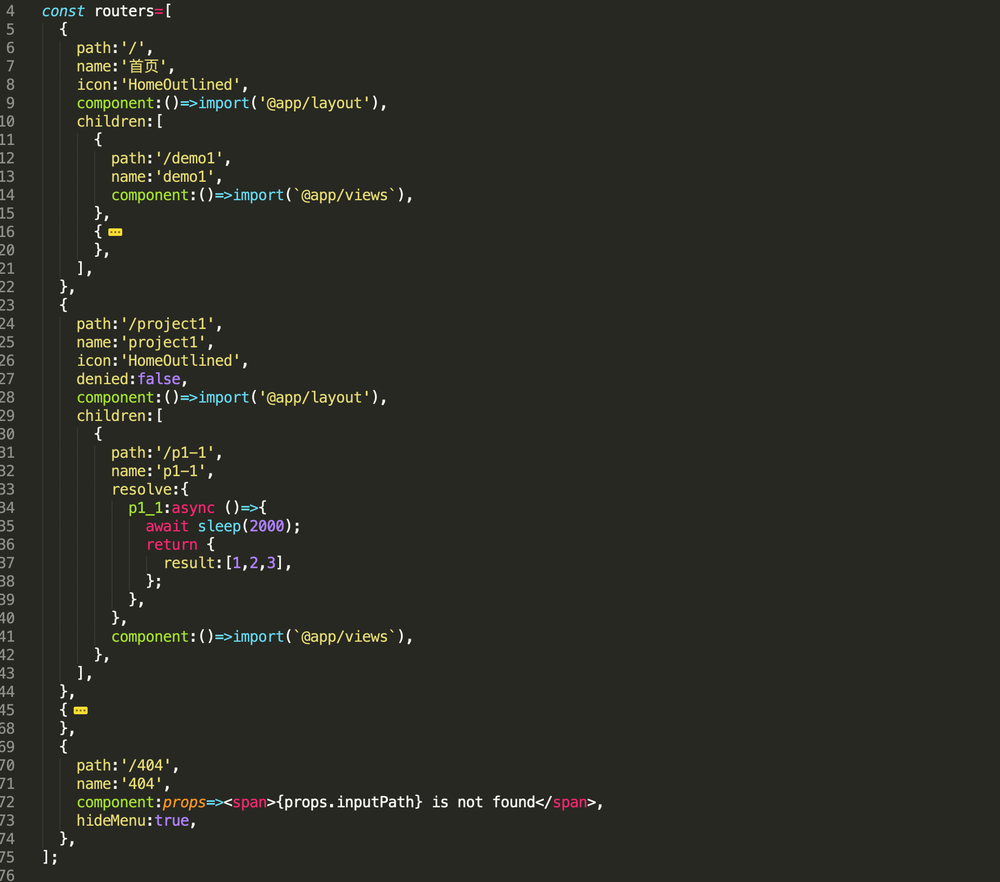
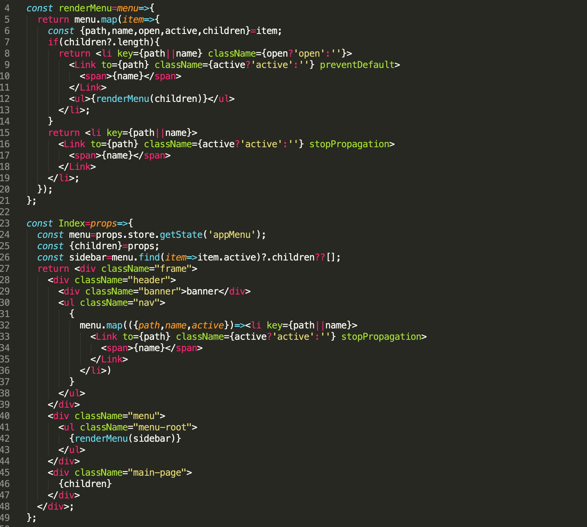
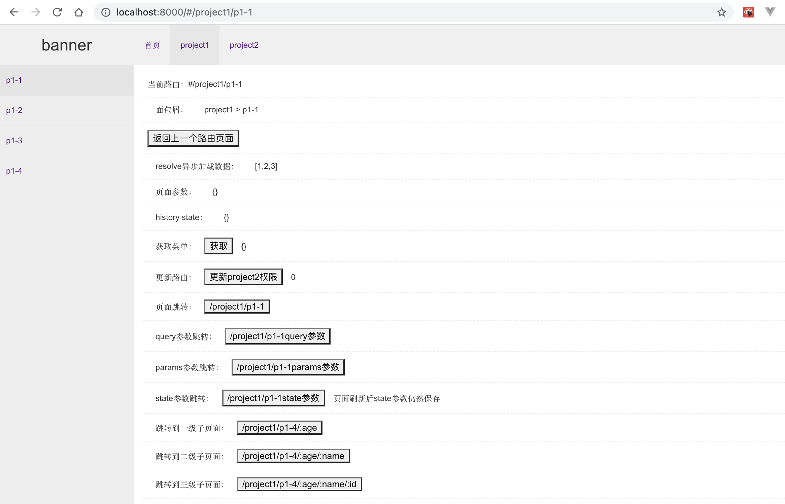

# router使用示例

[useRouter的使用](https://github.com/ihuxy/doc/blob/master/router/useRouter%E4%BD%BF%E7%94%A8.md)

## useRouter使用

```javascript
const output=useRouter(input);

```

### 入参input配置

```javascript

const others={
  projectKey:'123',
};

const input={
  browserRouter:false, //是否为browserHistory
  idKey:'path', //路由key值。如：url
  childKey:'children', //子层级key值。如：children
  beforeRender:()=>{}, //渲染前回调函数。
  afterRender:()=>{}, //渲染完回调函数。
  basepath:'', //路由前缀。
  routers:[], //路由表
  store:()=>{}, //状态管理
  inputPath:'', //初始化路由
  inputParams:{}, //初始化参数
  // 全局
  title:'test', //页面title。
  errorBoundary:null, //错误边界。默认有错误边界处理，可自定义。
  loading:null, //加载效果。默认有加载效果，可自定义。
  exact:false, //绝对路径
  ...others, //其它配置
};

```

### 出参output

```javascript
const {
  //订阅发布功能
  eventBus:{
    on,
    emit,
    off,
  },
  //路由跳转
  router:{
    push,
    replace,
  },
  //状态管理
  store:{
    getState,
    setState,
    subscribe,
  },
  updateRouter, //跟新路由
  output,
  loading,
}=output;

```

### 路由表配置

```javascript
const routerInput={
  path:'', //路径
  name:'', //展示名
  icon:'', //图标
  redirect:'', //重定向
  children:[], //子菜单配置
  component:'', //页面组件
  denied:false, //权限控制
  hideMenu:false, //菜单隐藏展示
  resolve:null, //数据请求并缓存，可用store.getState(key)获取，store.setState(state)更新。
  loadData:null, //数据请求，不缓存数据。
  // 单个路由配置
  title:'test', //页面title。
  errorBoundary:null, //错误边界。默认有错误边界处理，可自定义。
  loading:null, //加载效果。默认有加载效果，可自定义。
  exact:false, //绝对路径
  ...others, //其它配置
};

```



### 路由组件props带入的参数

```javascript
const {
  //订阅发布功能
  eventBus:{
    on,
    emit,
    off,
  },
  //路由跳转
  router:{
    push,
    replace,
  },
  //状态管理
  store:{
    getState,
    setState,
    subscribe,
  },
  updateRouter, //跟新路由
  //浏览器history
  history:{
    getState,
    back,
    forward,
    go,
  },

  current, //当前路由列表，包含父级所有路由信息
  inputPath, //传入的路径
  path, //当前路径
  params, //页面参数
  name, //页面名称
  basepath, //路由前缀
  children, //子组件
  open, //是否为打开状态
  active, //是否为选中状态
}=routerOutput;

```

## Link使用

```javascript
<Link {...props} />

```

### Link属性

```javascript
const props={
  to:'', //跳转路径
  onClick, //点击事件。除了跳转外的其它事件，一般不设置。
  preventDefault:false, //阻止跳转事件
  stopPropagation:false, //阻止冒泡
  exact:true, //是否为绝对路径
  children, //子组件
  ...rest, //其它配置
};

```

详细使用方法可参考菜单代码：



[代码地址](https://github.com/ahyiru/zys/tree/master/blog/router)




[md文档](http://ihuxy.com:8010/)